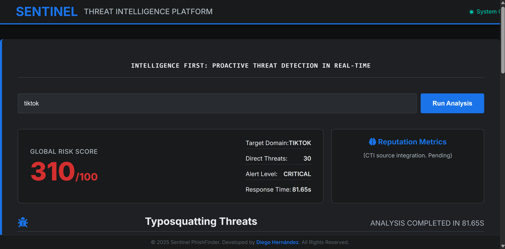

# 🛡️ Sentinel PhishFinder: My Typosquatting Analysis Tool

Hello! This is a project I developed for my portfolio, focused on proactive cybersecurity analysis and threat intelligence.

The core idea behind **Sentinel PhishFinder** is to simulate an Enterprise-level "Threat Intelligence" platform designed to identify, classify, and present **Typosquatting** (malicious domains mimicking legitimate ones, like `goog1e.com` for `google.com`) threats.

---

## 💡 Project Motivation and Learnings

As a security developer/analyst, I realized that many phishing incidents start with simple typosquatting. I wanted to build a tool that not only detects these threats but also presents them in a high-impact, actionable format for a security team.

* **Problem Solved:** Addresses the need for a quick tool to convert raw Whois data into an **actionable risk metric** (the Global Risk Score).
* **Key Learning:** Deepened skills in service orchestration (Flask API serving a JS frontend) and designing data-intensive UIs (`Data Grid Dark Mode`).

---

## ✨ Features

* **Typosquatting Detection:** Scans the web for domains that are visually or typographically similar to the target domain.
* **Real-time Whois Data:** Retrieves creation date, domain age, and associated IP addresses for identified suspicious domains.
* **Global Risk Scoring:** Provides a **Global Risk Score (0-100)** for immediate threat assessment.
* **Professional Interface:** Features a clean, enterprise-grade, dark-mode design built with HTML, CSS, and JavaScript.

---

## 🖼️ Quick Demo

Here is a view of the platform in action, showcasing the Global Risk Score and identified threats.



---

## 💻 Tech Stack

| Component | Technology | Role |
| :--- | :--- | :--- |
| **Backend API** | **Python (Flask)** | Handles input, executes the Typosquatting and Whois logic, and serves the data as JSON. |
| **Frontend UI** | **HTML5, CSS3, JavaScript** | Single Page Application (SPA) displaying results, risk score, and execution time. |
| **Dependencies** | `python-whois`, `dnspython`, `flask` | Libraries used for domain information and DNS resolution. |

---

## 🚀 Getting Started

Follow these steps to set up and run the **Sentinel PhishFinder** platform locally.

### 1. Prerequisites

You must have **Python 3.x** and **Git** installed on your system.

### 2. Installation and Setup

1.  **Clone the Repository:**
    ```bash
    git clone [https://github.com/diego1822-arch/sentinel-phishfinder.git](https://github.com/diego1822-arch/sentinel-phishfinder.git)
    cd sentinel-phishfinder
    ```

2.  **Install Dependencies:**
    Using a virtual environment is highly recommended.

    ```bash
    # Create and activate a virtual environment
    python -m venv venv
    source venv/bin/activate  # On Windows use: venv\Scripts\activate
    
    # Install required Python packages (from your requirements.txt)
    pip install -r requirements.txt
    ```

3.  **File Structure Check:**
    Ensure your directory contains the following structure:
    ```
    sentinel-phishfinder/
    ├── app.py              # Flask API backend
    ├── requirements.txt    
    ├── assets/             # Contains screenshots/GIFs
    ├── backend/
    │   └── app.py
    │   └── typosquatter.py 
    └── frontend/
        └── index.html      # User Interface
    ```

### 3. Running the Platform

1.  **Start the Backend API:**
    Run the Flask server from within the **`backend`** directory.

    ```bash
    cd backend
    python app.py
    # The API will run on [http://127.0.0.1:5000/](http://127.0.0.1:5000/)
    ```

2.  **Access the Frontend:**
    Open the frontend interface in your web browser. **Double-click** the `index.html` file or use the full path:

    ```
    file:///path/to/sentinel-phishfinder/frontend/index.html
    ```
    
    *(Note: The interface connects to the API running on `http://127.0.0.1:5000/api/analizar`)*

---

## ✍️ Author and Contact

This project was developed by **[Your Full Name or Nickname, e.g., Diego Hernández]** as a portfolio piece showcasing skills in Python development, cybersecurity, and enterprise UI design.

* **GitHub:** [Your GitHub Username]
* **LinkedIn:** [Link to your LinkedIn Profile]